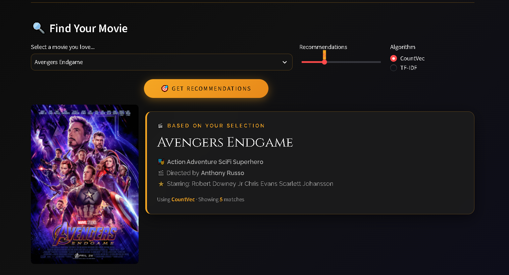
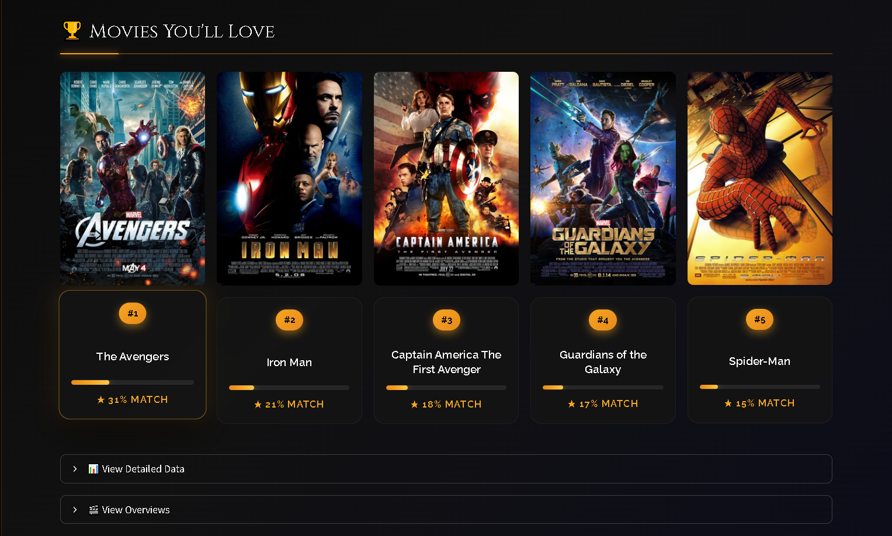
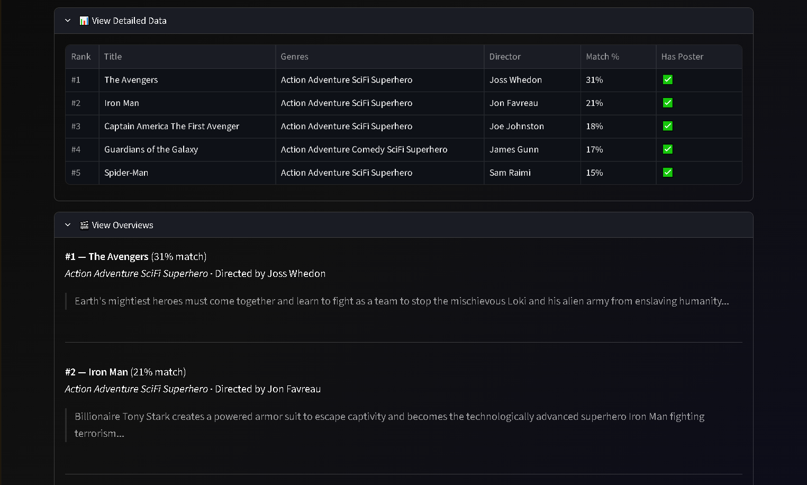

<div align="center">


# 🎬 CineMatch AI

### *Discover Your Next Favorite Film with AI-Powered Recommendations*

<p align="center">
  <a href="#-features">Features</a> •
  <a href="#-demo">Demo</a> •
  <a href="#-tech-stack">Tech Stack</a> •
  <a href="#-installation">Install</a> •
  <a href="#-how-it-works">How It Works</a> •
  <a href="#-project-structure">Structure</a>
</p>

<br/>


<br/>

[](https://github.com/YOUR_USERNAME/cinematch-ai/stargazers)
[](https://github.com/YOUR_USERNAME/cinematch-ai/network/members)
[](https://github.com/YOUR_USERNAME/cinematch-ai/issues)

<br/>


</div>

---

<div align="center">

## 🌟 About The Project

</div>

**CineMatch AI** is an intelligent, content-based movie recommendation system that suggests films tailored to your taste. Built with cutting-edge Machine Learning and Natural Language Processing techniques, it analyzes movie features like **genres, cast, directors, plot, and keywords** to find perfect matches — all wrapped in a stunning dark cinema-themed interface.

> 💡 **The Problem:** "What should I watch tonight?" — A question that plagues millions daily.
> 
> 🎯 **The Solution:** An AI that understands movies at a deep level and recommends films you'll actually love.

---

<div align="center">

## ✨ Features

</div>

<table>
  <tr>
    <td align="center" width="33%">
      
      <h3>🧠 Dual ML Algorithms</h3>
      <p>Toggle between <b>CountVectorizer</b> & <b>TF-IDF</b> for personalized recommendations</p>
    </td>
    <td align="center" width="33%">
      
      <h3>🎬 100+ Movies</h3>
      <p>Curated database from <b>Marvel epics</b> to <b>Kubrick classics</b></p>
    </td>
    <td align="center" width="33%">
      
      <h3>🎨 Cinema UI</h3>
      <p>Premium <b>dark theme</b> with glassmorphism & gold accents</p>
    </td>
  </tr>
  <tr>
    <td align="center">
      
      <h3>⚡ Lightning Fast</h3>
      <p>Cached recommendations using <b>cosine similarity</b> for instant results</p>
    </td>
    <td align="center">
      
      <h3>🌐 100% Offline</h3>
      <p>Local poster system — <b>no API keys needed!</b></p>
    </td>
    <td align="center">
      
      <h3>📱 Responsive</h3>
      <p>Perfect on <b>desktop</b>, <b>tablet</b>, and <b>mobile</b> devices</p>
    </td>
  </tr>
</table>

---

<div align="center">

### 📸 Screenshots

</div>

<div align="center">
  
  <p><i>🏠 Beautiful homepage with cinema-themed dark UI</i></p>
</div>

<br/>

<div align="center">
  
</div>

<br/>

<div align="center">
  
  <p align="center"><i>🎯 AI-powered recommendations with real movie posters</i></p>
</div>

<br/>

<div align="center">
  
  <p align="center"><i>📊 Detailed statistics</i></p>
</div>

<br/>

---

<div align="center">

## 🛠️ Tech Stack

</div>

<div align="center">

### **Frontend & UI**

&nbsp;

&nbsp;


### **Machine Learning & Data**

&nbsp;

&nbsp;

&nbsp;


### **Development Tools**

&nbsp;

&nbsp;

&nbsp;


</div>

<br/>

| Category | Technologies |
|----------|--------------|
| **Language** | Python 3.10+ |
| **Web Framework** | Streamlit |
| **ML Library** | Scikit-learn |
| **Data Processing** | Pandas, NumPy |
| **NLP** | Custom stemming & stopword removal |
| **Similarity Metric** | Cosine Similarity |
| **Vectorization** | CountVectorizer, TF-IDF |
| **Styling** | Custom CSS with Glassmorphism |
| **Version Control** | Git & GitHub |

---

<div align="center">

## 🚀 Installation

</div>

### **Prerequisites**
Make sure you have installed:
- ✅ Python 3.10 or higher
- ✅ pip package manager
- ✅ Git

### **Quick Start (3 Steps)**

```bash
# 1️⃣ Clone the repository
git clone https://github.com/KaranSharma00/cinematch-ai.git
cd cinematch-ai

# 2️⃣ Install dependencies
pip install -r requirements.txt

# 3️⃣ Launch the app
streamlit run app.py